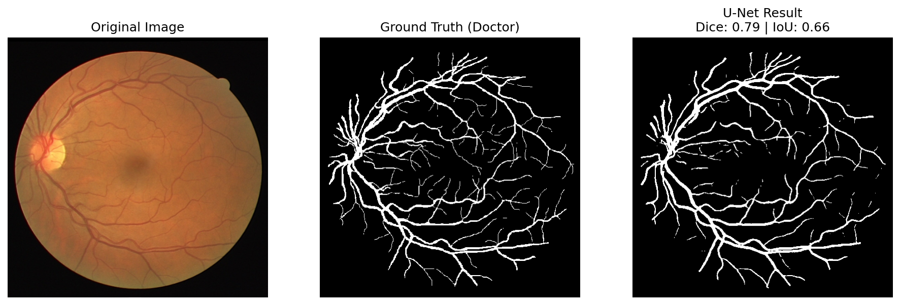

# Retina Blood Vessel Segmentation using U-Net

This project implements a U-Net deep learning architecture for the automatic segmentation of retinal blood vessels from the DRIVE dataset. The system is designed to assist in the diagnosis of ocular diseases such as Diabetic Retinopathy by providing precise vessel maps.

## Project Overview

* **Model:** U-Net with Batch Normalization.
* **Dataset:** DRIVE (Digital Retinal Images for Vessel Extraction).
* **Loss Function:** Combined Dice Loss + Binary Cross Entropy (BCE).
* **Metrics:** Dice Coefficient, IoU (Jaccard), Accuracy, Recall, Precision.

## Project Structure

```text
├── augment.py           # Script for offline data augmentation
├── data.py              # PyTorch Dataset class definition
├── loss.py              # Custom DiceBCELoss implementation
├── model.py             # U-Net architecture implementation
├── utils.py             # Helper functions (seeding, directory creation)
├── train.ipynb          # Notebook for training the model
├── test.ipynb           # Notebook for evaluation and visualization
├── requirements.txt     # List of python dependencies
├── README.md            # Project documentation
└── files/               # Stores model checkpoints (checkpoint.pth)

```

## Dataset & Preprocessing

The model is trained on the DRIVE dataset. Due to the small size of the original dataset (20 training images), we apply offline data augmentation.

* **Augmentation Techniques:** Horizontal Flip, Vertical Flip, and Rotation.
* **Preprocessing:** Images are resized to 512x512, normalized to [0, 1], and channel-first transposed for PyTorch.

## Installation

1. Clone the repository:
```bash
git clone https://github.com/your-username/retina-segmentation.git
cd retina-segmentation
```


2. Install dependencies:
```bash
pip install -r requirements.txt
```


## Usage Pipeline

### 1. Data Generation

Run the augmentation script to process the raw DRIVE dataset and generate the `new_data/` folder containing augmented training and testing sets.

```bash
python augment.py
```

### 2. Training

Open `train.ipynb` to train the model.

* **Configuration:** 50 Epochs, Batch Size 1, Adam Optimizer (lr=1e-4).
* **Checkpointing:** The model saves the best weights based on validation loss to `files/checkpoint.pth`.

### 3. Evaluation

Open `test.ipynb` to evaluate the model on the test set.

* This script calculates metrics and generates side-by-side comparisons of the Original Image, Ground Truth, and Model Prediction.
* Results are saved in the `results/` directory.


***Note** : **Update pathes** before running code*. 


## Performance Results

The model achieves high segmentation accuracy on the test set. Below are the quantitative metrics and performance curves:

| Metric | Score |
| --- | --- |
| **Accuracy** | 96.22% |
| **Dice** | 77.25% |
| **IoU (Jaccard)** | 63.30% |
| **Inference Speed** | ~185 FPS |




## Architecture Details

The network follows the standard U-Net encoder-decoder structure:

* **Encoder:** 4 blocks of Convolution -> BatchNorm -> ReLU -> MaxPool.
* **Bottleneck:** Connects the encoder and decoder.
* **Decoder:** 4 blocks of UpSampling -> Concatenation (Skip Connections) -> Convolution.
* **Output:** A 1x1 convolution with Sigmoid activation to produce a binary mask.


## References

* [DRIVE Dataset](https://www.kaggle.com/datasets/zionfuo/drive2004?resource=download)
